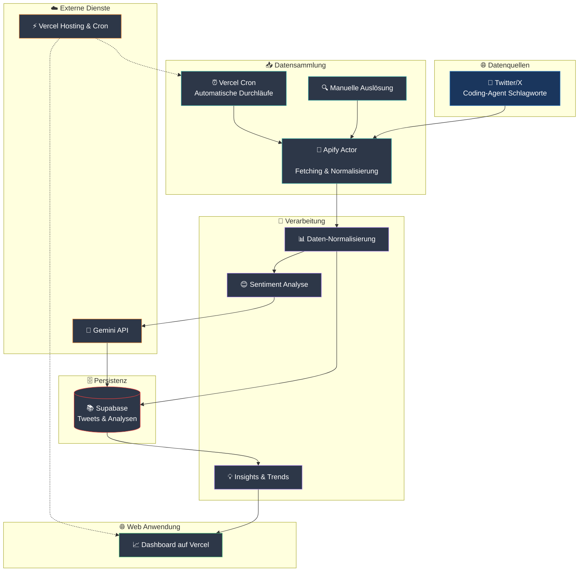

# Apify-Pipeline Konzept

## Zielsetzung
Die Pipeline sammelt regelmäßig Tweets rund um Coding-Agenten, normalisiert die Daten, analysiert Sentiments und stellt die Ergebnisse in einem gehosteten Dashboard bereit.

## Ablauf auf hoher Ebene
1. **Trigger:** Ein Vercel Cron Job (Pro-Plan) ruft das interne Endpoint `/api/start-apify-run` auf, das anschließend die Apify Run API anspricht. Zusätzlich können manuelle Durchläufe angestoßen werden.
2. **Datenerfassung (Apify Actor):** Der Actor nutzt entweder X API Pro-Zugänge (≈ US$ 5 k/Monat) oder den Apify Tweet Scraper; Letzterer unterliegt Anti-Monitoring-Beschränkungen, sodass Intervalle sorgfältig gedrosselt werden müssen.
3. **Vorverarbeitung:** Die rohen Tweets werden bereinigt, angereichert (z. B. Quelle, Zeitstempel, Plattform) und in ein einheitliches Format überführt.
4. **Persistenz (Supabase):** Normalisierte Datensätze werden in Supabase gespeichert. Historische Werte bleiben erhalten und bilden die Grundlage für Analysen.
5. **Sentiment-Analyse (Gemini):** Gemini 2.5 klassifiziert Sentiments via Structured Output (keine dedizierte Sentiment-API) und speichert Ergebnisse zurück in Supabase; Kosten/TPS werden je nach Modellvariante (Flash, Flash Lite, Pro) überwacht.
6. **Frontend (Vercel):** Eine Next.js-Anwendung visualisiert die Daten (Trends, Metriken, Einzeldatensätze) und konsumiert ausschließlich die Supabase-API.

## Komponenten & Verantwortlichkeiten
- **Apify Actor:** Datenerfassung, Normalisierung, Versand an Supabase – wahlweise via X API (Pro-Tier) oder Apify Scraper mit regulatorischer Drosselung.
- **Supabase:** Persistenzschicht (Tabellen für Rohdaten, normalisierte Tweets, Sentiment-Ergebnisse) mit `sb_secret_*` Keys und PG17-konformen Erweiterungen.
- **Google Gemini:** Structured-Output-Klassifikation über eine serverseitige Funktion oder einen Worker, der auf neue Datensätze reagiert.
- **Next.js Frontend:** Darstellung der Statistiken, Filterungen, Trend-Erkennung; Build-Target Node.js 20+ auf Vercel.
- **Vercel Cron:** Zeitgesteuertes Auslösen des internen `/api/start-apify-run` Proxys.

> Hinweis: Supabase rotiert Secrets als `sb_secret_*`; Deployments müssen Service-Rollen-Schlüssel regelmäßig erneuern und PG17-kompatible Erweiterungen wählen.
> Hinweis: Next.js-Builds auf Vercel laufen ab September 2025 ausschließlich auf Node.js 20+, Tests sollten die async Request APIs der App Router berücksichtigen.

## Datenfluss (Mermaid)

## Offene Punkte für spätere Iterationen
- Detailliertes Datenmodell (Tabellen, Schemata, Trigger) definieren.
- Fehlerbehandlung und Monitoring (Retries, Alerting) spezifizieren.
- Authentifizierung und Zugriffsfunktionen für Supabase und Apify festlegen.
- Kosten- und Latenzbetrachtung für Apify, Supabase und Gemini evaluieren.
- Integrationstests und Staging-Setup planen.
