# Apify Pipeline Concept

## Objective
The pipeline regularly collects tweets about coding agents, normalizes the data, analyzes sentiments, and presents the results in a hosted dashboard.

Architecture note: The repository follows a Vertical Slice Architecture. The complete pipeline lives in the `src/ApifyPipeline` slice, which encapsulates both the scheduler jobs and the Next.js App Router interface. API routes in the `app/api` directory merely import slice endpoints (REPR: Request → Endpoint → Handler → Response DTO), so any changes remain within the slice.

## High-Level Flow
1. **Trigger:** A Vercel Cron Job (Pro plan) calls the internal endpoint `/api/start-apify-run`, which then invokes the Apify Run API. The App Router file `app/api/start-apify-run/route.ts` re-exports the slice endpoint `src/ApifyPipeline/Web/Application/Commands/StartApifyRun`. Manual runs can also be triggered.
2. **Data Collection (Apify Actor):** Uses the Apify Twitter Search Scraper. By default (when `COLLECTOR_PRODUCT` is omitted), the collector runs sequentially per enabled product; each run uses that product’s keywords with its own `maxItems` cap (default 100) and respects anti-monitoring restrictions.
3. **Preprocessing:** Raw tweets are cleaned, enriched (e.g., source, timestamp, platform), and transformed into a uniform format.
4. **Persistence (Supabase):** Normalized records are stored in Supabase. Historical values are preserved and form the foundation for analysis.
5. **Sentiment Analysis (Gemini):** Supabase Edge Function `sentiment-processor` invokes Gemini 2.5 via Structured Output (no dedicated sentiment API) and stores results back in Supabase; costs/TPS are monitored depending on model variant (Flash, Flash Lite, Pro).
6. **Frontend (Vercel):** A Next.js application visualizes the data (trends, metrics, individual records) and exclusively consumes the Supabase API.

## Components & Responsibilities
- **Collector Script:** Orchestrates Apify Twitter Search Scraper runs sequentially per product by default. Entry: `scripts/start-apify-run.ts` (Endpoint proxy: `app/api/start-apify-run`).
- **Supabase:** Persistence layer (tables for raw data, normalized tweets, sentiment results) with `sb_secret_*` keys and PG17-compliant extensions. (Slice: `src/ApifyPipeline/DataAccess`)
- **Google Gemini:** Structured-output classification executed by Supabase Edge Function `sentiment-processor` (source: `src/ApifyPipeline/ExternalServices/Gemini/EdgeFunctions/sentimentProcessor`).
- **Next.js Frontend:** Display of statistics, filtering, trend detection; build target Node.js 20+ on Vercel. (Location: `app/dashboard/*`)
- **Vercel Cron:** Time-triggered execution of the internal `/api/start-apify-run` proxy. (Slice: `src/ApifyPipeline/Web/Application/Commands/StartApifyRun`)

> Note: Supabase rotates secrets as `sb_secret_*`; deployments must regularly renew service role keys and choose PG17-compatible extensions.
> Note: Next.js builds on Vercel run exclusively on Node.js 20+ as of September 2025, tests should account for the App Router's async Request APIs.

## Data Flow (Mermaid)

```mermaid
graph TB
    %% Data Sources
    subgraph Sources [🌐 Data Sources]
        Twitter[📢 Twitter/X<br/>Coding Agent Keywords]
    end

    %% Collection Layer
    subgraph Collection [📥 Data Collection]
        AutoCron[⏰ Vercel Cron<br/>Automatic Runs]
        ManualTrigger[🔍 Manual Trigger]
        Actor[🤖 Apify Actor
              <br/>Fetching & Normalization]
    end

    %% Processing & Intelligence
    subgraph Processing [🧠 Processing]
        DataNorm[📊 Data Normalization]
        Sentiment[😊 Sentiment Analysis]
        Insights[💡 Insights & Trends]
    end

    %% Storage
    subgraph Storage [🗄️ Persistence]
        Database[(📚 Supabase<br/>Tweets & Analysis)]
    end

    %% Frontend
    subgraph Frontend [🌐 Web Application]
        Analytics[📈 Dashboard on Vercel]
    end

    %% External Services
    subgraph External [☁️ External Services]
        Gemini[🤖 Gemini API]
        Vercel[⚡ Vercel Hosting & Cron]
    end

    %% Main Data Flow
    Twitter --> Actor

    AutoCron --> Actor
    ManualTrigger --> Actor

    Actor --> DataNorm
    DataNorm --> Database
    DataNorm --> Sentiment

    Sentiment --> Gemini
    Gemini --> Database

    Database --> Insights
    Insights --> Analytics

    Vercel -.-> AutoCron
    Vercel -.-> Analytics

    classDef source fill:#1a365d,stroke:#3182ce,color:#ffffff
    classDef collect fill:#2d3748,stroke:#38b2ac,color:#ffffff
    classDef process fill:#2d3748,stroke:#9f7aea,color:#ffffff
    classDef storage fill:#2d3748,stroke:#e53e3e,color:#ffffff
    classDef frontend fill:#2d3748,stroke:#48bb78,color:#ffffff
    classDef external fill:#2d3748,stroke:#ed8936,color:#ffffff

    class Twitter source
    class AutoCron,ManualTrigger,Actor collect
    class DataNorm,Sentiment,Insights process
    class Database storage
    class Analytics frontend
    class Gemini,Vercel external
```

## Current Status
- Vercel crons are currently disabled (vercel.json); use manual triggers until re-enabled after testing.
- The Supabase base schema including append-only triggers and RLS policies exists as a migration under `src/ApifyPipeline/DataAccess/Migrations/20250929_1200_InitApifyPipeline.sql`.
- Views `vw_daily_sentiment` and `vw_keyword_trends` are created but remain empty until you ingest tweets; the seed file (`src/ApifyPipeline/DataAccess/Seeds/20250929_1230_KeywordsSeed.sql`) includes multiple products (`keywords.product`).
- Supabase secret rotation runs via `npm run rotate:supabase` (TypeScript script [`scripts/rotate-supabase-secrets.ts`](file:///home/prinova/CodeProjects/agent-vibes/scripts/rotate-supabase-secrets.ts) uses Supabase Management API + Secrets Endpoint).
- The ingestion slice provides `/api/start-apify-run` via `app/api/start-apify-run/route.ts` and delegates to `src/ApifyPipeline/Web/Application/Commands/StartApifyRun`.
- Local/scripted ingestion runs are handled by [`scripts/start-apify-run.ts`](file:///home/prinova/CodeProjects/agent-vibes/scripts/start-apify-run.ts), which orchestrates per-product runs and persists results.
- Supabase Edge Function `sentiment-processor` source lives at `src/ApifyPipeline/ExternalServices/Gemini/EdgeFunctions/sentimentProcessor` and is built to `supabase/functions/sentiment-processor` via `npm run build:edge-functions`; `/api/process-sentiments` proxies to it with optional fallback to the legacy job.

## Open Items for Later Iterations
- Instrument monitoring/alerting for Supabase Edge Function failures and fallback invocations.
- Evaluate cost and latency considerations for Apify, Supabase, and Gemini.
- Plan integration tests (Edge Function + fallback) and staging setup.
