# Apify-Pipeline Konzept

## Zielsetzung
Die Pipeline sammelt regelmäßig Tweets rund um Coding-Agenten, normalisiert die Daten, analysiert Sentiments und stellt die Ergebnisse in einem gehosteten Dashboard bereit.

Architekturhinweis: Das Repository folgt einer Vertical Slice Architecture. Die komplette Pipeline lebt im Slice `src/ApifyPipeline`, der sowohl die Scheduler-Aufträge als auch die Next.js App-Router-Oberfläche kapselt. API-Routen im Verzeichnis `app/api` importieren lediglich Slice-Endpunkte (REPR: Request → Endpoint → Handler → Response DTO), sodass jede Änderungen innerhalb des Slices bleiben.

## Ablauf auf hoher Ebene
1. **Trigger:** Ein Vercel Cron Job (Pro-Plan) ruft das interne Endpoint `/api/start-apify-run` auf, das anschließend die Apify Run API anspricht. Die App-Router-Datei `app/api/start-apify-run/route.ts` re-exportiert dabei den Slice-Endpunkt `src/ApifyPipeline/Web/Application/Commands/StartApifyRun`. Zusätzlich können manuelle Durchläufe angestoßen werden.
2. **Datenerfassung (Apify Actor):** Der Actor nutzt entweder X API Pro-Zugänge (≈ US$ 5 k/Monat) oder den Apify Tweet Scraper; Letzterer unterliegt Anti-Monitoring-Beschränkungen, sodass Intervalle sorgfältig gedrosselt werden müssen.
3. **Vorverarbeitung:** Die rohen Tweets werden bereinigt, angereichert (z. B. Quelle, Zeitstempel, Plattform) und in ein einheitliches Format überführt.
4. **Persistenz (Supabase):** Normalisierte Datensätze werden in Supabase gespeichert. Historische Werte bleiben erhalten und bilden die Grundlage für Analysen.
5. **Sentiment-Analyse (Gemini):** Gemini 2.5 klassifiziert Sentiments via Structured Output (keine dedizierte Sentiment-API) und speichert Ergebnisse zurück in Supabase; Kosten/TPS werden je nach Modellvariante (Flash, Flash Lite, Pro) überwacht.
6. **Frontend (Vercel):** Eine Next.js-Anwendung visualisiert die Daten (Trends, Metriken, Einzeldatensätze) und konsumiert ausschließlich die Supabase-API.

## Komponenten & Verantwortlichkeiten
- **Apify Actor:** Datenerfassung, Normalisierung, Versand an Supabase – wahlweise via X API (Pro-Tier) oder Apify Scraper mit regulatorischer Drosselung. (Slice: `src/ApifyPipeline/Background/Jobs/TweetCollector`)
- **Supabase:** Persistenzschicht (Tabellen für Rohdaten, normalisierte Tweets, Sentiment-Ergebnisse) mit `sb_secret_*` Keys und PG17-konformen Erweiterungen. (Slice: `src/ApifyPipeline/DataAccess`)
- **Google Gemini:** Structured-Output-Klassifikation über eine serverseitige Funktion oder einen Worker, der auf neue Datensätze reagiert. (Slice: `src/ApifyPipeline/ExternalServices/Gemini`)
- **Next.js Frontend:** Darstellung der Statistiken, Filterungen, Trend-Erkennung; Build-Target Node.js 20+ auf Vercel. (Slice: `src/ApifyPipeline/Web/Components/Dashboard`)
- **Vercel Cron:** Zeitgesteuertes Auslösen des internen `/api/start-apify-run` Proxys. (Slice: `src/ApifyPipeline/Web/Application/Commands/StartApifyRun`)

> Hinweis: Supabase rotiert Secrets als `sb_secret_*`; Deployments müssen Service-Rollen-Schlüssel regelmäßig erneuern und PG17-kompatible Erweiterungen wählen.
> Hinweis: Next.js-Builds auf Vercel laufen ab September 2025 ausschließlich auf Node.js 20+, Tests sollten die async Request APIs der App Router berücksichtigen.

## Datenfluss (Mermaid)

```mermaid
graph TB
    %% Data Sources
    subgraph Sources [🌐 Datenquellen]
        Twitter[📢 Twitter/X<br/>Coding-Agent Schlagworte]
    end

    %% Collection Layer
    subgraph Collection [📥 Datensammlung]
        AutoCron[⏰ Vercel Cron<br/>Automatische Durchläufe]
        ManualTrigger[🔍 Manuelle Auslösung]
        Actor[🤖 Apify Actor
              <br/>Fetching & Normalisierung]
    end

    %% Processing & Intelligence
    subgraph Processing [🧠 Verarbeitung]
        DataNorm[📊 Daten-Normalisierung]
        Sentiment[😊 Sentiment Analyse]
        Insights[💡 Insights & Trends]
    end

    %% Storage
    subgraph Storage [🗄️ Persistenz]
        Database[(📚 Supabase<br/>Tweets & Analysen)]
    end

    %% Frontend
    subgraph Frontend [🌐 Web Anwendung]
        Analytics[📈 Dashboard auf Vercel]
    end

    %% External Services
    subgraph External [☁️ Externe Dienste]
        Gemini[🤖 Gemini API]
        Vercel[⚡ Vercel Hosting & Cron]
    end

    %% Main Data Flow
    Twitter --> Actor

    AutoCron --> Actor
    ManualTrigger --> Actor

    Actor --> DataNorm
    DataNorm --> Database
    DataNorm --> Sentiment

    Sentiment --> Gemini
    Gemini --> Database

    Database --> Insights
    Insights --> Analytics

    Vercel -.-> AutoCron
    Vercel -.-> Analytics

    classDef source fill:#1a365d,stroke:#3182ce,color:#ffffff
    classDef collect fill:#2d3748,stroke:#38b2ac,color:#ffffff
    classDef process fill:#2d3748,stroke:#9f7aea,color:#ffffff
    classDef storage fill:#2d3748,stroke:#e53e3e,color:#ffffff
    classDef frontend fill:#2d3748,stroke:#48bb78,color:#ffffff
    classDef external fill:#2d3748,stroke:#ed8936,color:#ffffff

    class Twitter source
    class AutoCron,ManualTrigger,Actor collect
    class DataNorm,Sentiment,Insights process
    class Database storage
    class Analytics frontend
    class Gemini,Vercel external
```

## Aktueller Status
- Supabase Basisschema inkl. Append-Only-Triggers und RLS-Policies liegt als Migration unter `src/ApifyPipeline/DataAccess/Migrations/20250929_1200_InitApifyPipeline.sql`.
- Views `vw_daily_sentiment` und `vw_keyword_trends` sind erstellt und liefern dank Seed-Daten (`src/ApifyPipeline/DataAccess/Seeds/20250929_1230_KeywordsSeed.sql`) Beispielmetriken für das Dashboard.
- Supabase Secret-Rotation läuft über `npm run rotate:supabase` (TypeScript-Script [`scripts/rotate-supabase-secrets.ts`](file:///home/prinova/CodeProjects/agent-vibes/scripts/rotate-supabase-secrets.ts) nutzt Supabase Management API + Secrets Endpoint).
- Der Ingestion-Slice stellt `/api/start-apify-run` über `app/api/start-apify-run/route.ts` bereit und delegiert an `src/ApifyPipeline/Web/Application/Commands/StartApifyRun` + `Background/Jobs/TweetCollector`.
- Der Apify Actor unter `src/ApifyPipeline/Background/Jobs/TweetCollector/TweetCollectorJob.ts` holt Keywords aus Supabase, startet den Twitter-Scraper, schreibt `cron_runs`, `raw_tweets` und `normalized_tweets` und kennzeichnet Duplikate.

## Offene Punkte für spätere Iterationen
- Fehlerbehandlung und Monitoring (Retries, Alerting) spezifizieren.
- Authentifizierung und Zugriffsfunktionen für Supabase und Apify festlegen.
- Kosten- und Latenzbetrachtung für Apify, Supabase und Gemini evaluieren.
- Integrationstests und Staging-Setup planen.
