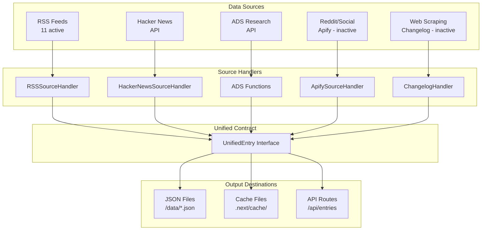

# AgentVibes Data Source Inventory

*Generated on: September 18, 2025*

## Executive Summary

The AgentVibes codebase contains a comprehensive data collection system with **23 implementation files** across **5 source types**. Currently **12 sources are configured and active**, providing data from RSS feeds, GitHub, academic papers, and social platforms.

## Active Data Sources

### RSS Feeds (11 sources)
| Source | Endpoint | Category | Update Cadence |
|--------|----------|----------|----------------|
| **Cursor Changelog** | https://api.cursor-changelog.com/api/versions/rss | product | hourly |
| **GitHub Copilot Blog** | https://github.blog/tag/copilot/feed/ | product | hourly |
| **GitHub Changelog** | https://github.blog/changelog/feed/ | product | hourly |
| **TechCrunch AI** | https://techcrunch.com/category/artificial-intelligence/feed/ | perspective | hourly |
| **The Verge AI** | https://www.theverge.com/ai-artificial-intelligence/rss/index.xml | perspective | hourly |
| **InfoQ AI/ML** | https://www.infoq.com/ai-ml/rss/ | perspective | hourly |
| **StackOverflow Blog** | https://stackoverflow.blog/feed/ | perspective | hourly |
| **Dev.to AI** | https://dev.to/feed/tag/ai | perspective | hourly |
| **Latent Space** | https://latentspace.dev/feed.xml | perspective | hourly |
| **OpenAI Blog** | https://openai.com/blog/rss/ | product | hourly |
| **Anthropic News** | https://www.anthropic.com/news/rss | product | hourly |

### API Sources (1 active)
| Source | Endpoint | Category | Update Cadence |
|--------|----------|----------|----------------|
| **Hacker News AI** | https://hn.algolia.com/api/v1/search_by_date | social | hourly |

### Academic Research (ADS Integration)
| Source | Type | Category | Update Cadence |
|--------|------|----------|----------------|
| **ADS API** | Research papers via Harvard ADS | research | daily |

*Keywords: "coding agent", "code generation", "AI assistant", "programming assistant"*

### Inactive Sources (Available but disabled)
- **Reddit Programming** - requires APIFY_TOKEN
- **Reddit Machine Learning** - requires APIFY_TOKEN  
- **Reddit Experienced Devs** - requires APIFY_TOKEN
- **Windsurf Changelog** - web scraping, disabled for testing
- **Claude Code Changelog** - GitHub raw scraping, disabled
- **Cursor Changelog (Web)** - web scraping, disabled

## Implementation Analysis

### Source Handler Classes Found

#### RSS Processing (`lib/sources/rss.ts`)
- **Class**: `RSSSourceHandler`
- **Features**: RSS parsing, keyword filtering, content extraction
- **Output**: Structured entries with title, summary, content, tags

#### Hacker News (`lib/sources/hackernews.ts`) 
- **Class**: `HackerNewsSourceHandler`
- **Features**: Algolia search API, keyword matching, popularity scoring
- **Output**: Stories with points, comments, and HN-specific metadata

#### Web Scraping (`lib/sources/changelog.ts`)
- **Classes**: `MarkdownChangelogHandler`, `HTMLChangelogHandler`
- **Features**: Changelog parsing for product updates
- **Status**: Implementation ready, disabled for MVP

#### Social Media (`lib/sources/apify.ts`)
- **Classes**: `ApifySourceHandler`, `RedditApifyHandler`, `WebScrapingApifyHandler`
- **Features**: Reddit/social scraping via Apify platform
- **Status**: Requires API token configuration

#### Research Papers (`lib/ads.ts`)
- **Function**: `searchAdsCodingAgents`
- **Features**: arXiv paper search, citation tracking, PDF linking
- **Output**: Academic papers with abstracts and metadata

### Base Infrastructure (`lib/sources/base.ts`)
- **Class**: `BaseSourceHandler` 
- **Features**: Common HTTP handling, keyword matching, health checks
- **Utilities**: Text truncation, slug generation, timeout handling

## Data Flow Architecture



## Source → Category Mappings

### Product Sources (5 sources)
- Cursor Changelog → product updates
- GitHub Copilot Blog → feature announcements  
- GitHub Changelog → platform updates
- OpenAI Blog → API/product releases
- Anthropic News → model releases

### Perspective Sources (6 sources)  
- TechCrunch AI → industry analysis
- The Verge AI → technology commentary
- InfoQ AI/ML → technical articles
- StackOverflow Blog → developer insights
- Dev.to AI → community tutorials
- Latent Space → AI research discussions

### Social Sources (1 active, 3 inactive)
- Hacker News AI → community discussions ✅
- Reddit Programming → developer discussions ❌ 
- Reddit Machine Learning → research discussions ❌
- Reddit Experienced Devs → professional insights ❌

### Research Sources (1 source)
- ADS API → arXiv computer science papers

## Update Cadences by Source Type

| Source Type | Frequency | Rationale |
|-------------|-----------|-----------|
| **RSS Feeds** | Every 1-2 hours | Real-time content, balanced API usage |
| **Hacker News** | Every hour | High-velocity discussion platform |
| **ADS Research** | Daily | Academic publishing slower pace |
| **Reddit/Social** | Every 2 hours | API rate limits, content velocity |
| **Web Scraping** | Every 6 hours | Respectful crawling, avoid blocks |

## Sample Output Formats

### RSS Entry Example
```json
{
  "id": "https://cursor.com/blog/cursor-0-42-release",
  "title": "Cursor 0.42: Enhanced AI Code Completion", 
  "summary": "Introducing improved AI suggestions...",
  "url": "https://cursor.com/blog/cursor-0-42-release",
  "publishedAt": "2024-01-15T10:30:00Z",
  "source": "rss",
  "category": "product",
  "tags": ["cursor", "ai", "code-completion"]
}
```

### Hacker News Entry Example  
```json
{
  "id": "38234567",
  "title": "New AI coding assistant beats GitHub Copilot",
  "summary": "Discussion about latest AI coding tools...", 
  "url": "https://example.com/ai-tool",
  "publishedAt": "2024-01-15T14:22:00Z",
  "source": "hackernews", 
  "category": "social",
  "metadata": {
    "points": 156,
    "comments": 47,
    "author": "techuser123"
  }
}
```

### ADS Research Example
```json
{
  "id": "2024arXiv240101234S",
  "title": "Large Language Models for Code Generation",
  "summary": "Comprehensive survey of LLMs applied to code...",
  "url": "https://arxiv.org/pdf/2401.01234.pdf", 
  "publishedAt": "2024-01-15T00:00:00Z",
  "source": "ads_build",
  "category": "research",
  "metadata": {
    "arxivClass": "cs.AI",
    "authors": "Smith, J. et al.", 
    "citations": 42
  }
}
```

## Technical Infrastructure

### Dependencies in Use
- **rss-parser**: RSS feed processing
- **cheerio**: HTML parsing for scraped content
- **apify-client**: Social media and web scraping
- **jsdom**: DOM manipulation for content extraction

### Configuration System
- **Source definitions**: [`lib/sources/config.ts`](file:///Users/sjarmak/agent-vibes/lib/sources/config.ts)
- **Base handler**: [`lib/sources/base.ts`](file:///Users/sjarmak/agent-vibes/lib/sources/base.ts) 
- **Type definitions**: [`types/sources.ts`](file:///Users/sjarmak/agent-vibes/types/sources.ts)

### Implementation Files
- **RSS handler**: [`lib/sources/rss.ts`](file:///Users/sjarmak/agent-vibes/lib/sources/rss.ts)
- **Hacker News**: [`lib/sources/hackernews.ts`](file:///Users/sjarmak/agent-vibes/lib/sources/hackernews.ts)
- **ADS integration**: [`lib/ads.ts`](file:///Users/sjarmak/agent-vibes/lib/ads.ts)
- **Apify handlers**: [`lib/sources/apify.ts`](file:///Users/sjarmak/agent-vibes/lib/sources/apify.ts)
- **Changelog scrapers**: [`lib/sources/changelog.ts`](file:///Users/sjarmak/agent-vibes/lib/sources/changelog.ts)

## Recommendations for Phase 3

### Priority 1: RSS Adapter Enhancement
- ✅ RSS infrastructure already working
- 🎯 **Next**: Ensure UnifiedEntry output format compliance
- 🎯 **Action**: Add category mapping logic to RSS handler

### Priority 2: GitHub Data Integration  
- ❌ No GitHub PR/Issue scrapers found in current scan
- 🎯 **Next**: Implement GitHub API integration or find existing scripts
- 🎯 **Action**: Check for separate repositories mentioned in plan

### Priority 3: ADS Integration Completion
- ✅ ADS API integration exists and functional
- 🎯 **Next**: Map to UnifiedEntry format with research category
- 🎯 **Action**: Create adapter wrapper for consistent output

### Priority 4: Social Media Activation
- ⚠️ Hacker News working but needs UnifiedEntry mapping
- ❌ Reddit sources need APIFY_TOKEN configuration
- 🎯 **Action**: Enable HN source, configure Apify for Reddit if needed

### Priority 5: Fallback Data Generation
- 🎯 **Action**: Create sample datasets for each active source
- 🎯 **Action**: Build offline demo mode with realistic data

## Next Steps for Implementation

1. **Update existing handlers** to output UnifiedEntry format
2. **Create adapter layer** to ensure contract compliance  
3. **Add category mapping** rules to source handlers
4. **Implement fallback data** generation for offline/demo mode
5. **Set up data pipeline** to generate JSON files for API consumption

*This inventory provides the foundation for Phase 3 implementation of data adapters and ETL processes.*
