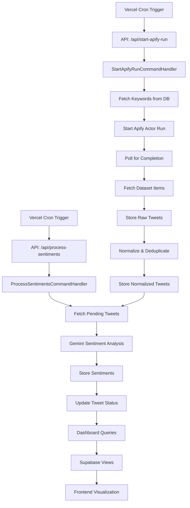

# Apify Pipeline Feature

**Automated Social Intelligence System**

The Apify Pipeline is a self-contained feature slice that automates the collection, normalization, sentiment analysis, and visualization of social media mentions about AI coding agents. It follows Vertical Slice Architecture (VSA) principles, owning its entire use case from API endpoints to database access.

---

## Feature Overview

### Purpose
Monitor and analyze social sentiment about AI coding agents (Cursor, Windsurf, Bolt, Copilot, etc.) by:
1. Collecting tweets via Apify's Twitter scraper
2. Normalizing and deduplicating data
3. Classifying sentiment using Google Gemini
4. Presenting insights through dashboards

### Key Capabilities
- ✅ **Automated Collection** - Scheduled tweet scraping based on configurable keywords
- ✅ **Sentiment Analysis** - AI-powered classification (positive/neutral/negative)
- ✅ **Historical Backfill** - Batch processing for historical data
- ✅ **Duplicate Detection** - Platform ID-based deduplication
- ✅ **Failure Resilience** - Automatic retry logic and failure tracking
- ✅ **Dashboard Visualization** - Real-time metrics and trends

---

## Architecture (VSA Pattern)

This feature follows **Vertical Slice Architecture**, organizing code by use case rather than technical layer.

```
src/ApifyPipeline/
├── Web/                              # User-initiated HTTP requests
│   ├── Application/                  # Request handlers & orchestration
│   │   ├── Commands/                 # Mutations (write operations)
│   │   │   ├── StartApifyRun/        # Trigger tweet collection
│   │   │   ├── ProcessBackfill/      # Process historical batches
│   │   │   └── ProcessSentiments/    # Analyze tweet sentiment
│   │   ├── Queries/                  # Reads (fetch data)
│   │   │   ├── GetKeywords/          # Fetch tracked keywords
│   │   │   ├── GetTweets/            # Fetch processed tweets
│   │   │   └── GetDashboardStats/    # Aggregate metrics
│   │   ├── Authorization/            # Access control (Vercel cron auth)
│   │   └── Middleware/               # Cross-cutting concerns
│   ├── Core/                         # Pure business logic
│   │   ├── Models/                   # Domain entities
│   │   ├── Services/                 # Business operations
│   │   └── Transformations/          # Data normalization
│   ├── DataAccess/                   # Database operations (Supabase)
│   │   ├── Repositories/             # Data persistence layer
│   │   ├── Migrations/               # Schema definitions
│   │   └── Seeds/                    # Initial data
│   └── ExternalServices/             # Third-party integrations
│       ├── Apify/                    # Tweet collection client
│       ├── Gemini/                   # Sentiment analysis client
│       │   └── EdgeFunctions/        # Supabase Edge Function source
│       │       └── sentimentProcessor/  # Built to supabase/functions/
│       └── Supabase/                 # Database client
├── Background/                       # Time-triggered scheduled jobs
│   ├── Jobs/                         # Job definitions (Vercel cron)
│   │   ├── TweetCollectorJob/        # Automated collection
│   │   └── SentimentProcessorJob/    # Automated sentiment analysis
│   ├── Application/                  # Same structure as Web/Application
│   ├── Core/                         # Shared business logic
│   ├── DataAccess/                   # Shared data access
│   └── ExternalServices/             # Shared external services
├── Tests/                            # Unit & integration tests
│   ├── Unit/                         # Pure function tests
│   └── Integration/                  # End-to-end tests (future)
├── Docs/                             # Feature documentation
│   ├── ApifyPipeline-start-apify-run-runbook.md
│   ├── incident-response-runbook.md
│   └── README.md
└── Infrastructure/                   # Cross-cutting infrastructure
    └── Config/                       # Environment validation
```

### Flow Model

**User-initiated (Web/):**
```
HTTP Request → API Endpoint → Command Handler → Core Logic → DataAccess/ExternalServices → Response
```

**Time-triggered (Background/):**
```
Vercel Cron → Job → Command Handler → Core Logic → DataAccess/ExternalServices
```

---

## Core Components

### 1. API Endpoints (Web Entry Points)

| Endpoint | Method | Purpose | Trigger |
|----------|--------|---------|---------|
| `/api/start-apify-run` | POST | Initiate tweet collection | Vercel cron / Manual |
| `/api/process-sentiments` | POST | Analyze pending tweets | Vercel cron / Manual |
| `/api/process-backfill` | POST | Process historical batches | Manual |

**Location:** `app/api/*/route.ts`

### 2. Command Handlers (Application Layer)

**StartApifyRunCommandHandler**
- Validates request
- Fetches enabled keywords from database
- Initiates Apify actor run
- Records cron run metadata
- Polls for completion and normalizes results

**ProcessSentimentsCommandHandler**
- Fetches pending tweets (batch size configurable)
- Calls Gemini API for sentiment classification
- Updates tweet status and stores sentiment results
- Tracks failures for retry

**ProcessBackfillCommandHandler**
- Retrieves oldest pending backfill batch
- Triggers Apify run with date range filters
- Marks batch as processing/completed

**Location:** `src/ApifyPipeline/Web/Application/Commands/*/`

### 3. Core Transformations (Pure Logic)

**normalizeTweet()**
- Converts Apify payload to standardized format
- Extracts platform ID, author, text, engagement
- Validates required fields
- Returns typed `NormalizedTweet` model

**extractEngagement()**
- Parses likes, retweets, replies, views
- Handles missing or malformed data
- Returns structured engagement metrics

**Location:** `src/ApifyPipeline/Core/Transformations/`

### 4. External Service Clients

**ApifyClient**
- Starts actor runs with input configuration
- Polls run status until completion
- Fetches dataset items (tweets)
- Implements retry logic with exponential backoff

**GeminiClient**
- Sends tweet text for sentiment classification
- Parses AI response (label + score + summary)
- Tracks token usage and latency
- Handles rate limiting and errors

**SupabaseClient**
- Provides typed database access
- Used by repositories for data persistence
- Server-side client (service role key)

**Location:** `src/ApifyPipeline/ExternalServices/*/`

### 5. Data Access Repositories

**KeywordRepository**
- `getEnabledKeywords()` - Fetch active search terms
- `updateKeywordStatus()` - Enable/disable keywords

**CronRunRepository**
- `createCronRun()` - Start execution tracking
- `updateCronRun()` - Record completion metrics
- `getRecentRuns()` - Fetch execution history

**TweetRepository**
- `insertRawTweet()` - Store original Apify payload
- `upsertNormalizedTweet()` - Insert/update standardized tweet
- `getPendingSentimentTweets()` - Fetch unanalyzed tweets
- `updateTweetStatus()` - Mark processing stages

**SentimentRepository**
- `insertSentiment()` - Store Gemini analysis
- `getRecentSentiments()` - Fetch analyzed data
- `logFailure()` - Track processing errors

**Location:** `src/ApifyPipeline/DataAccess/Repositories/`

---

## Database Schema

### Tables

**keywords**
- Tracked search terms
- Fields: `id`, `keyword`, `enabled`, `created_at`, `updated_at`
- Seeded with 10+ AI agent names

**cron_runs**
- Execution history and metrics
- Fields: `id`, `trigger_source`, `status`, `started_at`, `finished_at`, `processed_new_count`, `processed_duplicate_count`, `processed_error_count`, `apify_run_id`, `metadata`
- Tracks every collection attempt

**raw_tweets**
- Original Apify payloads (JSONB)
- Fields: `id`, `platform`, `platform_id`, `payload`, `collected_at`, `ingestion_reason`, `keywords`
- Retention: 30 days (cleanup script)

**normalized_tweets**
- Standardized tweet data
- Fields: `id`, `raw_tweet_id`, `platform`, `platform_id`, `author_handle`, `text`, `status`, `engagement_*`, `keywords`, `posted_at`, `collected_at`
- Unique constraint: `(platform, platform_id)`

**tweet_sentiments**
- Gemini sentiment analysis results
- Fields: `id`, `normalized_tweet_id`, `sentiment_label`, `sentiment_score`, `summary`, `model_version`, `processed_at`, `tokens_used`, `latency_ms`
- One-to-one with normalized_tweets

**backfill_batches**
- Historical data processing queue
- Fields: `id`, `start_date`, `end_date`, `status`, `keywords`, `created_at`, `processed_at`, `metadata`

**sentiment_failures**
- Failed sentiment processing attempts
- Fields: `id`, `normalized_tweet_id`, `error_message`, `retry_count`, `last_attempted_at`

### Views

**vw_daily_sentiment**
- Aggregated daily sentiment trends
- Used for dashboard time-series charts

**vw_keyword_trends**
- Keyword-level analytics
- Tweet counts, avg sentiment, engagement metrics

**Migration:** [DataAccess/Migrations/20250929_1200_InitApifyPipeline.sql](DataAccess/Migrations/20250929_1200_InitApifyPipeline.sql)  
**Seed Data:** [DataAccess/Seeds/20250929_1230_KeywordsSeed.sql](DataAccess/Seeds/20250929_1230_KeywordsSeed.sql)

---

## Data Flow

### End-to-End Processing Pipeline



---

## Configuration

### Environment Variables

Required in `.env.local` or Vercel environment:

```bash
# Supabase Configuration
SUPABASE_URL=https://your-project.supabase.co
SUPABASE_SERVICE_ROLE_KEY=your-service-role-key
NEXT_PUBLIC_SUPABASE_URL=https://your-project.supabase.co
NEXT_PUBLIC_SUPABASE_ANON_KEY=your-anon-key

# Apify Configuration
APIFY_TOKEN=your-apify-token
APIFY_ACTOR_ID=apify/twitter-search-scraper
# APIFY_ACTOR_BUILD=latest  # Optional

# Google Gemini Configuration
GEMINI_API_KEY=your-gemini-api-key

# Optional: Manual API Authentication
INTERNAL_API_KEY=your-random-secret-key
```

**Validation:** Environment variables are validated at runtime via `Infrastructure/Config/env.ts`

### Request Configuration

**StartApifyRun (Tweet Collection):**
```typescript
{
  triggerSource: "vercel-cron" | "manual-test" | "manual",
  requestedBy?: string,
  ingestion: {
    tweetLanguage?: "en",
    sort?: "Top" | "Latest",
    maxItemsPerKeyword?: number,      // Default: 200
    keywordBatchSize?: number,        // Default: 5
    cooldownSeconds?: number,         // Default: 0
    minimumEngagement?: {
      retweets?: number,
      favorites?: number
    }
  },
  metadata?: Record<string, unknown>
}
```

**ProcessSentiments:**
```typescript
{
  batchSize?: number  // Default: 10, Max: 50
}
```

---

## Operational Workflows

### 1. Scheduled Collection (Automated)

**Frequency:** Every 6 hours (Vercel cron)

**Flow:**
1. Cron triggers `/api/start-apify-run`
2. Handler fetches enabled keywords
3. Apify scrapes tweets (Top sort, 200 per keyword)
4. Results normalized and stored
5. Duplicate tweets skipped
6. Metrics recorded in `cron_runs`

**Monitoring:**
- Check `cron_runs` table for status
- Alert on `status = 'failed'` or low `processed_new_count`

### 2. Scheduled Sentiment Processing (Automated)

**Frequency:** Every 1 hour (Vercel cron)

**Flow:**
1. Cron triggers `/api/process-sentiments`
2. Handler fetches 10 tweets with `status = 'pending_sentiment'`
3. Gemini analyzes each tweet
4. Sentiments stored, tweet status updated to `processed`
5. Failures logged to `sentiment_failures`

**Monitoring:**
- Check sentiment processing rate
- Alert on high failure count
- Monitor Gemini API quota usage

### 3. Historical Backfill (Manual)

**Use Case:** Collect historical data before pipeline was deployed

**Flow:**
```bash
# 1. Enqueue batches (7 days, 1-day chunks)
npm run enqueue:backfill -- --days=7 --batch-size=1

# 2. Process batches one at a time
curl -X POST http://localhost:3000/api/process-backfill \
  -H "x-api-key: $INTERNAL_API_KEY"

# 3. Check queue status
# SQL: SELECT * FROM backfill_batches ORDER BY created_at DESC;

# 4. Repeat step 2 until all batches processed
```

**Timeline:** Each batch takes ~5-20 minutes depending on Apify actor performance.

### 4. Failed Sentiment Retry (Manual)

**Use Case:** Replay tweets that failed sentiment processing

**Flow:**
```bash
npm run replay:sentiments

# Fetches tweets from sentiment_failures table
# Retries with exponential backoff
# Removes from failures table on success
```

### 5. Data Cleanup (Periodic)

**Raw Tweet Cleanup** (keeps last 30 days):
```bash
npm run cleanup:raw-tweets -- --dry-run  # Preview
npm run cleanup:raw-tweets               # Execute
```

**Sentiment Failure Cleanup** (removes stale records):
```bash
npm run cleanup:sentiment-failures -- --max-age-days=90
```

---

## Testing

### Local Testing

**Quick Start:**
```bash
# Validate environment
npm run health-check

# Manual collection test
curl -X POST http://localhost:3000/api/start-apify-run \
  -H "Content-Type: application/json" \
  -d '{
    "triggerSource": "manual-test",
    "ingestion": {"maxItemsPerKeyword": 20}
  }'

# Manual sentiment test
curl -X POST http://localhost:3000/api/process-sentiments \
  -d '{"batchSize": 5}'
```

**Comprehensive Guide:** [../../docs/apify-pipeline/local-testing-guide.md](../../docs/apify-pipeline/local-testing-guide.md)

### Unit Tests

**Run tests:**
```bash
npm test                                    # All tests
npm test -- normalizeTweet                  # Specific test
npm run test:watch                          # Watch mode
```

**Coverage:**
- ✅ Core transformations (`normalizeTweet`, `extractEngagement`)
- ✅ Validators (Zod schemas)
- ✅ Business rules

**Future:** Integration tests for end-to-end workflows

---

## Monitoring & Observability

### Key Metrics

**Collection Health:**
- Cron run success rate (`cron_runs.status = 'succeeded'`)
- New tweets per run (`cron_runs.processed_new_count`)
- Duplicate rate (`processed_duplicate_count / total_processed`)

**Sentiment Processing:**
- Processing latency (`tweet_sentiments.latency_ms`)
- Token usage per batch (`tweet_sentiments.tokens_used`)
- Failure rate (`COUNT(sentiment_failures)`)

**Dashboard Queries:**
```sql
-- Collection success rate (last 24 hours)
SELECT 
  COUNT(*) as total_runs,
  COUNT(CASE WHEN status = 'succeeded' THEN 1 END) as successful,
  ROUND(100.0 * COUNT(CASE WHEN status = 'succeeded' THEN 1 END) / COUNT(*), 2) as success_rate
FROM cron_runs
WHERE started_at > now() - interval '24 hours';

-- Sentiment processing throughput
SELECT 
  DATE_TRUNC('hour', processed_at) as hour,
  COUNT(*) as tweets_processed,
  ROUND(AVG(latency_ms)::numeric, 0) as avg_latency_ms,
  SUM(tokens_used) as total_tokens
FROM tweet_sentiments
WHERE processed_at > now() - interval '24 hours'
GROUP BY hour
ORDER BY hour DESC;
```

### Alerts (Recommended)

- ❗ Cron run failure (immediate)
- ⚠️ Low tweet collection count (<50 per run)
- ⚠️ High sentiment failure rate (>10%)
- ⚠️ Gemini API quota approaching limit

---

## Security

### Access Control

**API Authentication:**
- Vercel cron jobs authenticated via `x-vercel-cron: 1` header
- Manual API calls (backfill) require `x-api-key: $INTERNAL_API_KEY`
- Unauthorized requests return 401

**Secret Management:**
- Development: `.env.local` (git-ignored)
- Production: Vercel environment variables (encrypted)
- Rotation: Quarterly via `npm run rotate:supabase`

**Database:**
- Server-side client uses service role key (full access)
- Client-side dashboard uses anon key (RLS policies if needed)
- No secrets exposed to frontend

### Known Considerations

**Apify Token in URL:**
- Standard Apify authentication method (token in query param)
- Transmitted over HTTPS (encrypted in transit)
- May appear in server logs
- **Mitigation:** Quarterly rotation, monitor Apify usage

---

## Ownership & Responsibilities

| Area | Owner | Contact |
|------|-------|---------|
| **Feature Development** | Engineering Team | `#agent-vibes-dev` |
| **Keyword Management** | Analytics Guild | `#analytics-insights` |
| **Operations & Monitoring** | Platform Ops | `#ops-oncall` |
| **Incident Response** | On-call Engineer | `#backend-support` |
| **Secret Rotation** | DevOps Team | `#ops-oncall` |

### Keyword Updates

**Process:**
1. Analytics Guild proposes keyword changes in weekly sync
2. Update seed file: [DataAccess/Seeds/20250929_1230_KeywordsSeed.sql](DataAccess/Seeds/20250929_1230_KeywordsSeed.sql)
3. Apply via Supabase Studio SQL Editor or CLI
4. Verify: `SELECT * FROM keywords WHERE enabled = true;`

---

## Documentation

### Internal Documentation

**This Directory:**
- [ApifyPipeline-start-apify-run-runbook.md](Docs/ApifyPipeline-start-apify-run-runbook.md) - Operational procedures
- [incident-response-runbook.md](Docs/incident-response-runbook.md) - Troubleshooting guide
- [Docs/README.md](Docs/README.md) - Slice documentation index

**Project Root:**
- [../../docs/apify-pipeline/local-testing-guide.md](../../docs/apify-pipeline/local-testing-guide.md) - Comprehensive testing
- [../../docs/apify-pipeline/internal-testing-quickstart.md](../../docs/apify-pipeline/internal-testing-quickstart.md) - Quick reference
- [../../docs/apify-pipeline/specification.md](../../docs/apify-pipeline/specification.md) - Technical requirements
- [../../docs/apify-pipeline/overview.md](../../docs/apify-pipeline/overview.md) - Architecture diagrams

### External Documentation

- **Apify API:** https://docs.apify.com/api/v2
- **Supabase:** https://supabase.com/docs
- **Gemini API:** https://ai.google.dev/docs
- **Next.js 15:** https://nextjs.org/docs

---

## Future Enhancements

### Planned
- [ ] Integration tests for end-to-end workflows
- [ ] Real-time streaming dashboard (WebSocket)
- [ ] Advanced filtering (date ranges, sentiment, keywords)
- [ ] Export functionality (CSV, JSON)
- [ ] Historical trend comparison

### Considered
- [ ] Multi-platform support (Reddit, Hacker News)
- [ ] Advanced NLP (topic modeling, entity extraction)
- [ ] Alerting on sentiment shifts
- [ ] Keyword recommendation engine
- [ ] A/B testing for sentiment prompts

---

## VSA Compliance Checklist

This feature adheres to Vertical Slice Architecture principles:

- [x] **Feature Ownership** - Slice owns entire use case (collection → visualization)
- [x] **REPR Flow** - Request → Endpoint → Processing → Response
- [x] **CQRS** - Commands (StartApifyRun, ProcessSentiments) separated from Queries (GetTweets, GetDashboardStats)
- [x] **Explicit Boundaries** - No cross-slice dependencies; uses contracts for external data
- [x] **Pure Core Logic** - Transformations in `Core/` are side-effect-free
- [x] **Clear Input/Output** - API contracts defined with Zod schemas
- [x] **Self-Contained Tests** - Tests reside within feature slice
- [x] **Documentation** - Feature-specific docs in `Docs/`

---

## Quick Reference

### Commands
```bash
npm run health-check              # Validate environment
npm run build:edge-functions      # Build Edge Functions for deployment
npm run functions:serve           # Serve Edge Functions locally
npm run enqueue:backfill          # Queue historical data
npm run replay:sentiments         # Retry failures
npm run cleanup:raw-tweets        # Archive old data
npm run rotate:supabase           # Rotate secrets (ops)
```

### API Endpoints
```bash
POST /api/start-apify-run         # Trigger collection
POST /api/process-sentiments      # Analyze tweets
POST /api/process-backfill        # Process historical
```

### Database Tables
- `keywords` - Search terms
- `cron_runs` - Execution history
- `normalized_tweets` - Processed tweets
- `tweet_sentiments` - Sentiment analysis

### Key Files
- Entry: `app/api/*/route.ts`
- Handlers: `Web/Application/Commands/*/`
- Logic: `Core/Transformations/`
- Data: `DataAccess/Repositories/`
- Services: `ExternalServices/*/client.ts`

---

**Feature Status:** ✅ Production-ready  
**Last Updated:** September 30, 2025  
**Maintainer:** Engineering Team
